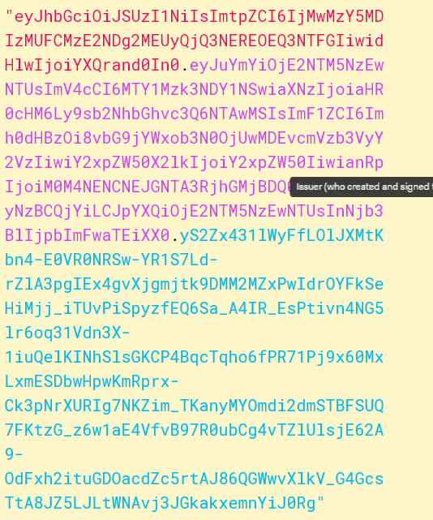
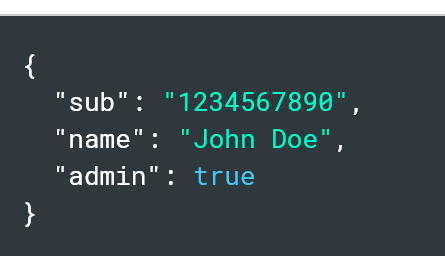
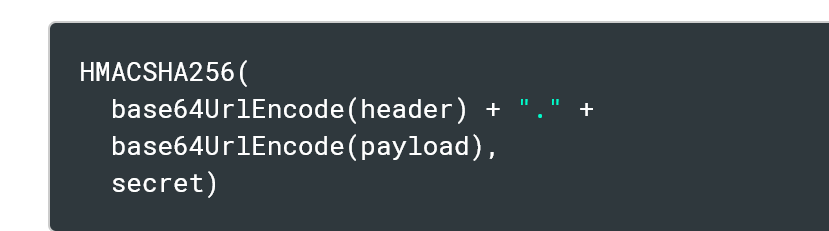
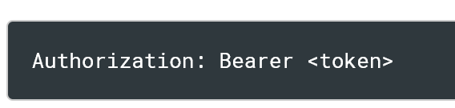
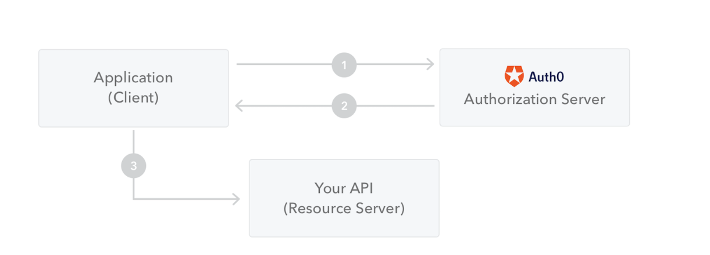

###jwt官网 https://jwt.io/introduction
###JWT
    JSON Web Token（JWT）是一种开放标准（RFC 7519），它定义了一种紧凑且自包含的方式，用于在各方之间作为JSON对象安全地传输信息。
    此信息可以验证和信任，因为它是经过数字签名的。JWT可以使用秘密（使用HMAC算法）或使用RSA或ECDSA的公钥/私钥对签名。

        简而言之JWT 就是使用了加密算法的json格式的数据，里面包含了一些基础信息

    虽然JWT可以加密，以在各方之间提供保密性，但我们将重点关注签名令牌。签名令牌可以验证其中包含的声明的完整性，而加密令牌则对其他方隐藏这些声
    明。当令牌使用公钥/私钥对签名时，签名还证明只有持有私钥的一方才是签名方。

        简而言之 单单使用jwt不够安全依旧可能被篡改所以要加入证书保证信息不会被轻易篡改

###什么时候需要使用到JWT
    一、授权：这是使用JWT最常见的场景。用户登录后，每个后续请求都将包括JWT，允许用户访问该令牌允许的路由、服务和资源。单点登录是目前广泛使用JWT
    的一种功能，因为它的开销很小，并且能够轻松地跨不同的域使用。

        换而言之 就像之前使用Identity登录的时候 Identity会存用户信息到Cookies中，之后每次需要授权的时候去对比Cookies里面的信息 JWT也是如此，
        为了避免总是请求JWT 所以有个refreshToken

    二、信息交换：JSON Web令牌是在各方之间安全传输信息的好方法。因为JWT可以签名，例如，使用公钥/私钥对，您可以确保发件人是他们所说的人。此外，
    由于签名是使用标头和有效负载计算的，因此您还可以验证内容是否未被篡改。

###JWT的构成
        在其紧凑的形式中，JSON Web标记由三部分组成，三部分由点（.）分隔，

        Header
        Payload
        Signature  
  

####Header

    标头通常由两部分组成：令牌的类型（JWT）和正在使用的签名算法（如HMAC SHA256或RSA）。

####Payload
    令牌的第二部分是有效负载，其中包含声明。声明是关于实体（通常是用户）和其他数据的声明。有三种类型的声明：注册的、公共的和私人的。

    一、注册声明:
        这些声明是一组预定义的声明，不是强制性的，但建议使用，以提供一组有用的、可互操作的声明。其中包括：iss（发行机构）、
    exp（到期时间）、sub（主题）、aud（受众）等

    二、公开声明:
        这些声明可以被JWT的使用方例如三方平台定义。但是为了避免冲突公开声明应该被定义在IANA JSON Web Token注册机构或者被定义成一个URI这个URI包含防止冲突的命名空间。

    三、私有声明:
        这些是用户为了与第三方共享信息而创建的声明，需要经过用户授权，这样的声明既不是注册的也不是公开的声明。
   
     然后对有效负载进行Base64Url编码，形成JSON Web令牌的第二部分。

     注意:尽管JWT对内容进行Base64的加密但是依然可以被任何人中途获取到，所以不要
     将私有敏感的信息放入JWT的payload和header中除非它是经过其他加密的

###Signature
    要生成Signature部分你必须要带上Header，payload的编码方式，
    secret，在其头部带上使用的加密算法。
例如
     
  Signature被用来验证消息在传递中是否被改变,对于使用私钥签名的令牌，它还可以验证JWT的发送者是它所说的人。

###Json Web Token 是如何工作的
    在认证的时候,用户使用他们的身份凭证成功登录，一个JWT就会被返回到用户所登录的应用中。
    自此Token就被当做身份凭证，
    最关心的是避免安全问题。总的来说你不应该保留tokens当不需要token的时候。

    通常开发者也不应该将敏感信息存储在浏览器中，因为缺乏安全。

    无论什么时候用户想要访问被保护的路由或者资源，用户代理例如浏览器应该发送JWT，典型的方式
    在Http-HEADER:Authorization中使用Bearer模式
    
例如
    
###
    在某些情况下这将是一种无状态的授权机制.服务器保护的路由将会检查验证的Http-Header:Authorization 里面的验证JWT，如果是当前的JWT(说明JWT会过
    期)用户将被允许访问被保护的资源。如果JWT包含一些必要的数据，这些数据需要在数据库中被查询到，JWT便可以减少查询的次数。只用在jwt过期后重新查
    询，尽管这样的情况并不是一定的。

    注意:如果将JWT发送到http headers，你应该避免它们过大。因为在某些服务器中不接受超过8KB的信息在headers中。
     Auth0 Fine-Grained Authorization.就是一种解决方案

    如果令牌在Authorization header中发送，则跨源资源共享（CORS）不会成为问题，因为它不使用cookie。
使用图
  

 私以为授权服务器是一种保护代理的设计模式